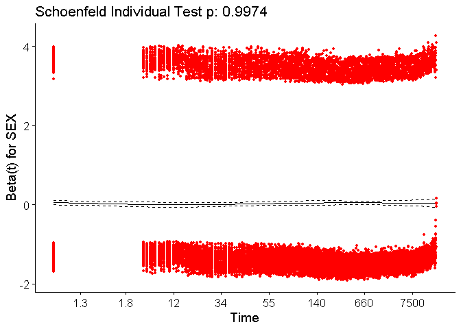

## Data

This exercise utlises data from the Fatality Analysis Reporting System (FARS) for roadway crashes which invovled in at least one death of a pedestrian or bicyclist.

This datasets are prepared from 15 years worth of data, dowloaded with the pedestrian and bicyclist fatality events extracted. 3 final datasets of 5 year aggregates are finally prepared for use in this study.


```r
#cleaning data
library(readr)
```

```
## Warning: package 'readr' was built under R version 3.4.4
```

```r
# Load the car package
library(car)
```

```
## Warning: package 'car' was built under R version 3.4.4
```

```
## Loading required package: carData
```

```
## Warning: package 'carData' was built under R version 3.4.4
```

```r
ttd0206pedbike <- read_csv("ttd0206pedbike_plus1.csv") #5 year aggregated data from 2002 to 2006
```

```
## Warning: Missing column names filled in: 'X1' [1]
```

```
## Parsed with column specification:
## cols(
##   .default = col_integer(),
##   LATITUDE = col_double(),
##   LONGITUD = col_double()
## )
```

```
## See spec(...) for full column specifications.
```

```r
ttd0711pedbike <- read_csv("ttd0711pedbike_plus1.csv") #5 year aggregated data from 2007 to 2011
```

```
## Warning: Missing column names filled in: 'X1' [1]
```

```
## Parsed with column specification:
## cols(
##   .default = col_integer(),
##   DR_ZIP = col_double(),
##   PREV_ACC = col_double(),
##   PREV_SUS = col_double(),
##   PREV_DWI = col_double(),
##   PREV_SPD = col_double(),
##   PREV_OTH = col_double(),
##   LAST_YR = col_double(),
##   LATITUDE = col_double(),
##   LONGITUD = col_double()
## )
## See spec(...) for full column specifications.
```

```r
ttd1216pedbike <- read_csv("ttd1216pedbike_plus1.csv") #5 year aggregated data from 2012 to 2016
```

```
## Warning: Missing column names filled in: 'X1' [1]
```

```
## Parsed with column specification:
## cols(
##   .default = col_integer(),
##   LATITUDE = col_double(),
##   LONGITUD = col_double()
## )
## See spec(...) for full column specifications.
```

The dataset contains varaible with information onn the characteristics of the person invovled in the crash, and the attributes of the environment and situation relating to the crash.
Most of the variables are binary or nominal in nature and can be explained only by the data dictionary found here (https://www.nber.org/fars/ftp.nhtsa.dot.gov/fars/FARS-DOC/Analytical%20User%20Guide/USERGUIDE-2015.pdf)


```r
ttd0206pedbikeDOA <- subset(ttd0206pedbike,SEX < 3 ,select = STATE:ttd_mins)
ttd0711pedbikeDOA <- subset(ttd0711pedbike,SEX < 3 ,select = STATE:ttd_mins)
ttd1216pedbikeDOA <- subset(ttd1216pedbike,SEX < 3 ,select = STATE:ttd_mins)

ttd0206pedbikeDOA <- subset(ttd0206pedbikeDOA,HOSPITAL < 9 ,select = STATE:ttd_mins)
ttd0711pedbikeDOA <- subset(ttd0711pedbikeDOA,HOSPITAL < 9 ,select = STATE:ttd_mins)
ttd1216pedbikeDOA <- subset(ttd1216pedbikeDOA,HOSPITAL < 9 ,select = STATE:ttd_mins)

ttd0206pedbikeDOA <- subset(ttd0206pedbikeDOA,AGE < 99 ,select = STATE:ttd_mins)
ttd0711pedbikeDOA <- subset(ttd0711pedbikeDOA,AGE < 99 ,select = STATE:ttd_mins)
ttd1216pedbikeDOA <- subset(ttd1216pedbikeDOA,AGE < 99 ,select = STATE:ttd_mins)
```
 
Our data preparation invovles removing variables with "unknown" elements from our three selected attributes of interest (Age of pedestrian: continuous, sex: 1-male 2-female, Hospital: 0-was not transported to the hospital 1-was transported to the hospital)
 
Our dependant variable for the analysis is the "ttd_min" variable which is the time to death of the victim as measured in minutes.

## Survivability Analysis

The Cox proportional-hazards model (Cox, 1972) is essentially a regression model commonly used statistical in medical research for investigating the association between the survival time of patients and one or more predictor variables.

The Cox proportional hazards model makes sevral assumptions. Thus, it is important to assess whether a fitted Cox regression model adequately describes the data.


```r
library(survival)
```

```
## Warning: package 'survival' was built under R version 3.4.4
```

```r
library(survminer)
```

```
## Warning: package 'survminer' was built under R version 3.4.4
```

```
## Loading required package: ggplot2
```

```
## Warning: package 'ggplot2' was built under R version 3.4.4
```

```
## Loading required package: ggpubr
```

```
## Warning: package 'ggpubr' was built under R version 3.4.4
```

```
## Loading required package: magrittr
```

```
## Warning: package 'magrittr' was built under R version 3.4.4
```

```r
library(survivalAnalysis)
```

```
## Warning: package 'survivalAnalysis' was built under R version 3.4.4
```

```r
# compute the survival probability by sex.
fit.sex <- survfit(Surv(ttd_mins) ~ SEX, data = ttd0206pedbikeDOA)
print(fit.sex)
```

```
## Call: survfit(formula = Surv(ttd_mins) ~ SEX, data = ttd0206pedbikeDOA)
## 
##           n events median 0.95LCL 0.95UCL
## SEX=1 17008  17008     41      40      42
## SEX=2  6799   6799     47      46      50
```

```r
summary(fit.sex)$table
```

```
##       records n.max n.start events   *rmean *se(rmean) median 0.95LCL
## SEX=1   17008 17008   17008  17008 1488.749   37.67520     41      40
## SEX=2    6799  6799    6799   6799 1478.752   57.96533     47      46
##       0.95UCL
## SEX=1      42
## SEX=2      50
```

```r
# compute the survival probability by HOSPITAL
fit.hsp <- survfit(Surv(ttd_mins) ~ HOSPITAL, data = ttd0206pedbikeDOA)
print(fit.hsp)
```

```
## Call: survfit(formula = Surv(ttd_mins) ~ HOSPITAL, data = ttd0206pedbikeDOA)
## 
##                n events median 0.95LCL 0.95UCL
## HOSPITAL=0 10808  10808      1       1       1
## HOSPITAL=1 12999  12999    167     159     177
```

```r
summary(fit.hsp)$table
```

```
##            records n.max n.start events    *rmean *se(rmean) median
## HOSPITAL=0   10808 10808   10808  10808  114.7673   12.38889      1
## HOSPITAL=1   12999 12999   12999  12999 2625.4799   54.95567    167
##            0.95LCL 0.95UCL
## HOSPITAL=0       1       1
## HOSPITAL=1     159     177
```

We may wish to display how estimated survival depends upon the value of a covariate of interest.
Here we explore the two binary variables in our models on the survivability of the victim


```r
# Change color, linetype by strata, risk.table color by strata
ggsurvplot(fit.sex,
           pval = TRUE, conf.int = FALSE,
           risk.table = TRUE, # Add risk table
           xlab = "Time in minutes",   # customize X axis label.
           risk.table.col = "strata", # Change risk table color by groups
           linetype = "strata", # Change line type by groups
           surv.median.line = "hv", # Specify median survival
           legend.labs = c("Male", "Female"),    # change legend labels.
           break.time.by = 100,
           xlim = c(0, 300)
)
```

<!-- -->

```r
# Change color, linetype by strata, risk.table color by strata
ggsurvplot(fit.hsp,
           pval = TRUE, conf.int = FALSE,
           risk.table = TRUE, # Add risk table
           xlab = "Time in minutes",   # customize X axis label.
           risk.table.col = "strata", # Change risk table color by groups
           linetype = "strata", # Change line type by groups
           surv.median.line = "hv", # Specify median survival
           legend.labs = c("Not Hospitalised", "Hospitalised"),    # change legend labels.
           break.time.by = 100,
           palette = c("#E7B800", "#2E9FDF"), # custom color pale
           xlim = c(0, 300)
)
```

<!-- -->
From the first plot on sex difference we see that females have a higher survivability rate than males.

We also see a very large and significant difference in the rate of survivability between victims who were hospitalised and who weren't.


```r
#Multivariate Cox Regression
res.cox1 <- coxph(Surv(ttd_mins) ~ AGE + SEX +  HOSPITAL, data =  ttd0206pedbikeDOA)
summary(res.cox1)
```

```
## Call:
## coxph(formula = Surv(ttd_mins) ~ AGE + SEX + HOSPITAL, data = ttd0206pedbikeDOA)
## 
##   n= 23807, number of events= 23807 
## 
##                coef  exp(coef)   se(coef)        z Pr(>|z|)    
## AGE      -0.0034871  0.9965189  0.0003005  -11.606   <2e-16 ***
## SEX       0.0329780  1.0335278  0.0144057    2.289   0.0221 *  
## HOSPITAL -1.6652365  0.1891459  0.0146764 -113.463   <2e-16 ***
## ---
## Signif. codes:  0 '***' 0.001 '**' 0.01 '*' 0.05 '.' 0.1 ' ' 1
## 
##          exp(coef) exp(-coef) lower .95 upper .95
## AGE         0.9965     1.0035    0.9959    0.9971
## SEX         1.0335     0.9676    1.0048    1.0631
## HOSPITAL    0.1891     5.2869    0.1838    0.1947
## 
## Concordance= 0.732  (se = 0.002 )
## Rsquare= 0.4   (max possible= 1 )
## Likelihood ratio test= 12168  on 3 df,   p=<2e-16
## Wald test            = 13185  on 3 df,   p=<2e-16
## Score (logrank) test = 15207  on 3 df,   p=<2e-16
```

```r
res.cox2 <- coxph(Surv(ttd_mins) ~ AGE + SEX +  HOSPITAL, data =  ttd0711pedbikeDOA)
summary(res.cox2)
```

```
## Call:
## coxph(formula = Surv(ttd_mins) ~ AGE + SEX + HOSPITAL, data = ttd0711pedbikeDOA)
## 
##   n= 23288, number of events= 23288 
## 
##                coef  exp(coef)   se(coef)       z Pr(>|z|)    
## AGE      -0.0036452  0.9963614  0.0003008 -12.119   <2e-16 ***
## SEX       0.0086855  1.0087233  0.0145715   0.596    0.551    
## HOSPITAL -0.2219979  0.8009171  0.0044701 -49.663   <2e-16 ***
## ---
## Signif. codes:  0 '***' 0.001 '**' 0.01 '*' 0.05 '.' 0.1 ' ' 1
## 
##          exp(coef) exp(-coef) lower .95 upper .95
## AGE         0.9964     1.0037    0.9958    0.9969
## SEX         1.0087     0.9914    0.9803    1.0379
## HOSPITAL    0.8009     1.2486    0.7939    0.8080
## 
## Concordance= 0.712  (se = 0.002 )
## Rsquare= 0.13   (max possible= 1 )
## Likelihood ratio test= 3231  on 3 df,   p=<2e-16
## Wald test            = 2689  on 3 df,   p=<2e-16
## Score (logrank) test = 2844  on 3 df,   p=<2e-16
```

```r
res.cox3 <- coxph(Surv(ttd_mins) ~ AGE + SEX +  HOSPITAL, data =  ttd1216pedbikeDOA)
summary(res.cox3)
```

```
## Call:
## coxph(formula = Surv(ttd_mins) ~ AGE + SEX + HOSPITAL, data = ttd1216pedbikeDOA)
## 
##   n= 28131, number of events= 28131 
## 
##                coef  exp(coef)   se(coef)        z Pr(>|z|)    
## AGE      -0.0025498  0.9974535  0.0002887   -8.832   <2e-16 ***
## SEX       0.0281855  1.0285865  0.0132955    2.120    0.034 *  
## HOSPITAL -0.3482045  0.7059545  0.0028372 -122.730   <2e-16 ***
## ---
## Signif. codes:  0 '***' 0.001 '**' 0.01 '*' 0.05 '.' 0.1 ' ' 1
## 
##          exp(coef) exp(-coef) lower .95 upper .95
## AGE         0.9975     1.0026    0.9969    0.9980
## SEX         1.0286     0.9722    1.0021    1.0557
## HOSPITAL    0.7060     1.4165    0.7020    0.7099
## 
## Concordance= 0.75  (se = 0.001 )
## Rsquare= 0.414   (max possible= 1 )
## Likelihood ratio test= 15033  on 3 df,   p=<2e-16
## Wald test            = 15410  on 3 df,   p=<2e-16
## Score (logrank) test = 17463  on 3 df,   p=<2e-16
```

```r
sum0206 <- surv_summary(survfit(res.cox1, data = ttd0206pedbikeDOA))
sum0711 <- surv_summary(survfit(res.cox2, data = ttd0711pedbikeDOA))
sum1216 <- surv_summary(survfit(res.cox3, data = ttd1216pedbikeDOA))
head(sum0206)
```

```
##   time n.risk n.event n.censor      surv     std.err     upper     lower
## 1    1  23807    5556        0 0.8045654 0.003106756 0.8094794 0.7996811
## 2    2  18251     252        0 0.7939286 0.003231347 0.7989728 0.7889163
## 3    3  17999     182        0 0.7861282 0.003322902 0.7912648 0.7810250
## 4    4  17817     153        0 0.7794910 0.003400983 0.7847042 0.7743123
## 5    5  17664     172        0 0.7719370 0.003490113 0.7772355 0.7666746
## 6    6  17492     227        0 0.7618144 0.003610060 0.7672238 0.7564431
```


```r
test.ph <- cox.zph(res.cox1)
test.ph
```

```
##                rho    chisq        p
## AGE      -3.68e-02 3.23e+01 1.33e-08
## SEX      -2.11e-05 1.06e-05 9.97e-01
## HOSPITAL  3.87e-01 2.44e+03 0.00e+00
## GLOBAL          NA 2.45e+03 0.00e+00
```

```r
ggcox.1<- ggcoxzph(test.ph)
ggcox.1$`1`
```

<!-- -->

```r
ggcox.1$`2`
```

<!-- -->

```r
ggcox.1$`3`
```

<!-- -->

The proportional hazard assumption is supported by a non-significant relationship between residuals and time, and refuted by a significant relationship. As we observe from the Schoenfeld test, there is independence between residuals and time for sex, but not for age and hospitalization.

The process can be repeated for the last two datasets to explore the proportional hazard assumption between the coviariates and the time to death.

## Survivability Comparison Between 5-Year Groups

Since we have explored the influence of the covariates on the survivability of the crash victims, we will now use the analysis methods to plot the survivability of victims in our three datasets and compare the changes over the years.


```r
# Plot the baseline survival function for 2002 to 2006 data
plot <- ggsurvplot(survfit(res.cox1, data = ttd0206pedbikeDOA), palette = "#2E9FDF",
           break.time.by = 10000,
           #xlim = c(0, 500),
           ggtheme = theme_minimal())+ ggtitle("Plot of baseline survival function for 2002 to 2006 data")
plot
```

<!-- -->

```r
# Plot the baseline survival function for 2007 to 2011 data
ggsurvplot(survfit(res.cox2, data = ttd0711pedbikeDOA), palette = "#DF1530",
           break.time.by = 10000,
           #xlim = c(0, 500),
           ggtheme = theme_minimal())+ ggtitle("Plot of baseline survival function for 2007 to 2011 data")
```

<!-- -->

```r
# Plot the baseline survival function for 2012 to 2016 data
ggsurvplot(survfit(res.cox3, data = ttd1216pedbikeDOA), palette = "#72730C",
           break.time.by = 10000,
           #xlim = c(0, 500),
           ggtheme = theme_minimal())+ ggtitle("Plot of baseline survival function for 2012 to 2016 data")
```

<!-- -->

```r
# 3 way survival function for all 3 datasets
plot$plot+geom_step(data = sum0711,
                        mapping = aes(x = time, y = surv),
                        color = "#DF1530")+geom_step(data = sum1216,
                                                 mapping = aes(x = time, y = surv),
                                                 color = "#72730C")+ ggtitle("Plot of 3 way survival function for all 3 datasets")+ theme(legend.position="none")
```

<!-- -->

The Three way plot show us the the years 2007 to 2011 had a better range of survival or car crash victims than the other years (2002-2006 and 2012-2016)

We see from the plots that the greatest decrease inn survivability occurs in the first few minutes after the crash and as such we need to plot the graphs again with the necessary extents to observe the decay function better.


```r
# Plot the baseline survival function for 2002 to 2006 data
plot <- ggsurvplot(survfit(res.cox1, data = ttd0206pedbikeDOA), palette = "#2E9FDF",
           break.time.by = 100,
           xlim = c(0, 500),
           ggtheme = theme_minimal())+ ggtitle("Plot of baseline survival function for 2002 to 2006 data")
plot
```

<!-- -->

```r
# Plot the baseline survival function for 2007 to 2011 data
ggsurvplot(survfit(res.cox2, data = ttd0711pedbikeDOA), palette = "#DF1530",
           break.time.by = 100,
           xlim = c(0, 500),
           ggtheme = theme_minimal())+ ggtitle("Plot of baseline survival function for 2007 to 2011 data")
```

<!-- -->

```r
# Plot the baseline survival function for 2012 to 2016 data
ggsurvplot(survfit(res.cox3, data = ttd1216pedbikeDOA), palette = "#72730C",
           break.time.by = 100,
           xlim = c(0, 500),
           ggtheme = theme_minimal())+ ggtitle("Plot of baseline survival function for 2012 to 2016 data")
```

<!-- -->

```r
# 3 way survival function for all 3 datasets
plot$plot+geom_step(data = sum0711,
                        mapping = aes(x = time, y = surv),
                        color = "#DF1530")+geom_step(data = sum1216,
                                                 mapping = aes(x = time, y = surv),
                                                 color = "#72730C")+ ggtitle("Plot of 3 way survival function for all 3 datasets")+ theme(legend.position="none")
```

<!-- -->

The scaled extent graphs tell us another intereting story about the rate of survival decay for the three datasets of the respective year groups. we observe that the first 30 to 50 mins after an accident occurs are the most crucial in ensuring that the victim has up to 50% chance of survival. we also notice that the last 5 years (2012-2016) show a worrying trend of a reduced rate of survivability which would require further attention and exploration.

this analysis helps us justify the need to explore into more detail the increased safety risk for pedestrian and cyclists on our roadways.
