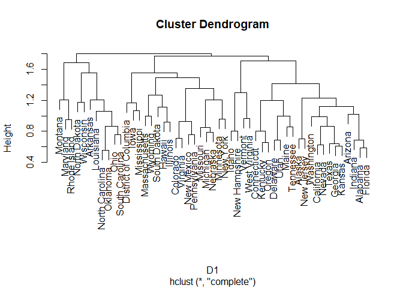
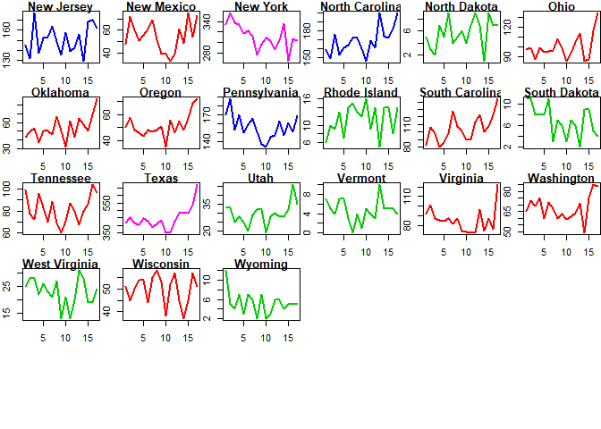

```r
library(foreign)
state_full <- read.csv("state_full_edit.csv", row.names = 1)
states <- as.matrix(state_full[,1:17])

par(mfrow=c(6,6))
par(mar=c(2,2,1,0))
for(i in 1:51){
    plot(states[i,], main=rownames(states)[i], type="l")
}
```

<!-- --><!-- -->


```r
library(wmtsa)
```

```
## Warning: package 'wmtsa' was built under R version 3.4.4
```

```r
library(pdc)
```

```
## Warning: package 'pdc' was built under R version 3.4.4
```

```r
library(cluster)
```

```
## Warning: package 'cluster' was built under R version 3.4.4
```

```r
library(TSclust)
```

```
## Warning: package 'TSclust' was built under R version 3.4.4
```


```r
D1 <- diss(states, "COR")
summary(D1)
```

```
##    Min. 1st Qu.  Median    Mean 3rd Qu.    Max. 
##  0.5584  1.0734  1.2595  1.2385  1.4054  1.7966
```

```r
library(reshape2)
```

```
## Warning: package 'reshape2' was built under R version 3.4.4
```

```r
melted_cormat <- melt(as.matrix(D1))
head(melted_cormat)
```

```
##         Var1    Var2     value
## 1    Alabama Alabama 0.0000000
## 2     Alaska Alabama 1.0578086
## 3    Arizona Alabama 1.0206734
## 4   Arkansas Alabama 1.3481277
## 5 California Alabama 0.8954261
## 6   Colorado Alabama 1.1064492
```

```r
library(ggplot2)
```

```
## Warning: package 'ggplot2' was built under R version 3.4.4
```

```r
ggplot(data = melted_cormat, aes(x=Var1, y=Var2, fill=value)) + 
  geom_tile()
```

<!-- -->
## Correlation

Correlation is an obvious option when considering the degree of similarity between time series. Generating a dissimilarity matrix is simple.

Note that, since this is a measure of dissimilarity, the range of correlation has been shifted from [-1,1] to [0,2].

Which stocks present the most unique time series?


```r
sort(rowMeans(as.matrix(D1)))
```

```
##           California                Texas               Oregon 
##             1.041069             1.044466             1.077511 
##               Kansas              Georgia             Missouri 
##             1.081472             1.092732             1.095058 
##             Virginia           Washington                 Ohio 
##             1.099347             1.104251             1.108629 
##               Nevada              Alabama              Florida 
##             1.113183             1.115872             1.116230 
##             Oklahoma           New Mexico       North Carolina 
##             1.120586             1.142477             1.142737 
##              Indiana             Kentucky             Colorado 
##             1.142832             1.143087             1.143447 
##             Michigan       South Carolina              Arizona 
##             1.144615             1.153799             1.155066 
##                Maine                 Utah         Pennsylvania 
##             1.167469             1.170046             1.184262 
##            Tennessee             Nebraska             Delaware 
##             1.192865             1.193759             1.197084 
##            Louisiana          Connecticut               Alaska 
##             1.198864             1.203413             1.222382 
##        Massachusetts               Hawaii            Minnesota 
##             1.234745             1.236954             1.243114 
##           New Jersey             Illinois        New Hampshire 
##             1.254036             1.255605             1.256152 
##        West Virginia          Mississippi                Idaho 
##             1.275165             1.291359             1.295969 
##                 Iowa             Arkansas              Wyoming 
##             1.308754             1.311796             1.322837 
##            Wisconsin              Vermont         North Dakota 
##             1.326415             1.336829             1.343009 
##             New York         South Dakota              Montana 
##             1.361321             1.395904             1.415993 
## District of Columbia         Rhode Island             Maryland 
##             1.418500             1.432278             1.498458
```

Now let's use those data to do some hierarchical clustering.


```r
C1 <- hclust(D1)
plot(C1)
```

<!-- -->

## Dynamic Time Warping Distance

Dynamic Time Warping is a technique for comparing time series where the timing or the tempo of the variations may vary between the series.


```r
D2 <- diss(states, "DTWARP")
```

Since the dissimilarity matrix is similar to one we've already looked at, we'll try a different approach to clustering, using the Partitioning Around Medoids (PAM) algorithm.


```r
library(cluster)
pam.result <- pam(D2, 5)
plot(pam.result)
```

<!-- -->

## Integrated Periodogram Distance

The integrated Periodogram is a variation of the periodogram where the power is accumulated as a function of frequency. This is a more robust measure for the purposes of comparing spectra. Signals with comparable integrated periodograms will contain variations at similar frequencies.


```r
D3 <- diss(states, "INT.PER")
```

The dissimilarity matrix paints yet another picture of the data. 


```r
pam.result2 <- pam(D3, 5)
plot(pam.result2)
```

<!-- -->


```r
par(mfrow=c(5,6))
par(mar=c(2,2,1,0))
for(i in 1:nrow(states)){
    plot(states[i,], main=rownames(states)[i], type="l", col=pam.result$clustering[i]+1,lwd=2)
}
```

<!-- --><!-- -->

