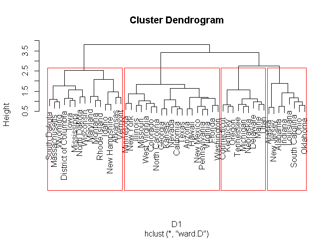

## Data
This exercise utilises data from the 50 states of the United States and the District of Columbia. The dataset contains car crash counts from the year 2000 to the year 2016, and corresponding yearly population numbers. As such the crash rate (crash count per million poulation) numbers have been computed and included as a stadardised measure in the data. 


```r
library(foreign)
```

```
## Warning: package 'foreign' was built under R version 3.4.4
```

```r
state_full <- read.csv("state_full_edit.csv", row.names = 1) #adding the data to R
states <- as.matrix(state_full[,68:84]) #select the crash rate data for the time series clustering

par(mfrow=c(6,6))
par(mar=c(2,2,1,0))
for(i in 1:51){
    plot(states[i,], main=rownames(states)[i], type="l")
}
```

<!-- --><!-- -->


```r
library(wmtsa)
```

```
## Warning: package 'wmtsa' was built under R version 3.4.4
```

```r
library(pdc)
```

```
## Warning: package 'pdc' was built under R version 3.4.4
```

```r
library(cluster)
```

```
## Warning: package 'cluster' was built under R version 3.4.4
```

```r
library(TSclust)
```

```
## Warning: package 'TSclust' was built under R version 3.4.4
```

## Correlation

Correlation is a good option when considering the degree of similarity between time series. 
Since this is a measure of dissimilarity, the range of correlation has been shifted from [-1,1] to [0,2].


```r
D1 <- diss(states, "COR")
summary(D1)
```

```
##    Min. 1st Qu.  Median    Mean 3rd Qu.    Max. 
##  0.6096  1.0716  1.2460  1.2348  1.4002  1.8108
```

```r
library(reshape2)
```

```
## Warning: package 'reshape2' was built under R version 3.4.4
```

```r
melted_cormat <- melt(as.matrix(D1))
head(melted_cormat)
```

```
##         Var1    Var2    value
## 1    Alabama Alabama 0.000000
## 2     Alaska Alabama 1.130464
## 3    Arizona Alabama 1.307207
## 4   Arkansas Alabama 1.509972
## 5 California Alabama 1.112689
## 6   Colorado Alabama 1.259293
```

```r
library(ggplot2)
```

```
## Warning: package 'ggplot2' was built under R version 3.4.4
```

```r
ggplot(data = melted_cormat, aes(x=Var1, y=Var2, fill=value)) + 
  geom_tile()
```

<!-- -->

```r
library(ggplot2)
ggplot(data = melted_cormat, aes(x=Var1, y=Var2, fill=value)) + 
  geom_tile()+scale_fill_gradient(low="red", high="blue")
```

<!-- -->


```r
sort(rowMeans(as.matrix(D1)))
```

```
##           California                Texas             Missouri 
##             1.031602             1.048472             1.061889 
##             Virginia             Michigan           Washington 
##             1.071774             1.088659             1.100849 
##         Pennsylvania             Illinois              Georgia 
##             1.101045             1.104747             1.106251 
##             Colorado           New Mexico               Oregon 
##             1.112992             1.113909             1.119828 
##               Nevada               Kansas              Arizona 
##             1.121670             1.126430             1.129488 
##       North Carolina              Florida               Hawaii 
##             1.130228             1.131961             1.156634 
##             Nebraska                 Utah                Maine 
##             1.169649             1.173741             1.176068 
##                 Ohio            Tennessee             Kentucky 
##             1.182581             1.184476             1.187551 
##            Minnesota             Oklahoma               Alaska 
##             1.190000             1.211159             1.212866 
##        West Virginia              Alabama        Massachusetts 
##             1.214040             1.214062             1.215868 
##       South Carolina          Connecticut              Indiana 
##             1.218364             1.231373             1.242461 
##             New York            Louisiana              Wyoming 
##             1.246042             1.249479             1.253759 
##          Mississippi        New Hampshire           New Jersey 
##             1.262398             1.273814             1.274504 
##             Delaware            Wisconsin         South Dakota 
##             1.285499             1.289132             1.289247 
##                Idaho                 Iowa              Vermont 
##             1.295099             1.300678             1.325001 
## District of Columbia             Arkansas         North Dakota 
##             1.352390             1.354711             1.417224 
##              Montana             Maryland         Rhode Island 
##             1.451033             1.457964             1.478915
```

##Clustering

Clustering allows us to group similar data elements together.
Since we computed the means of the crash rates we can use k-means clustering to group similar states


```r
fit <- kmeans(states, 4)
fit$center  # centers of each variable
```

```
##   crshcnt00per crshcnt01per crshcnt02per crshcnt03per crshcnt04per
## 1     10.25916     8.564539      7.98363     10.20242      8.72432
## 2     24.18533    27.228214     25.79072     24.39341     24.12954
## 3     13.62501    13.254975     13.61241     12.91526     11.90178
## 4     19.97506    19.173583     18.99363     18.70219     18.13238
##   crshcnt05per crshcnt06per crshcnt07per crshcnt08per crshcnt09per
## 1     8.499647     6.691679     7.797594      7.02581     6.489597
## 2    25.397175    27.981436    24.020214     22.38333    19.461631
## 3    12.166877    12.149316    12.803386     10.93843    10.209325
## 4    20.303235    19.408157    19.145347     16.45236    16.667146
##   crshcnt10per crshcnt11per crshcnt12per crshcnt13per crshcnt14per
## 1     7.103498     7.385221     8.311363     7.254892     7.699492
## 2    19.787846    21.064399    24.685657    23.282502    26.331833
## 3    10.726813    11.325590    11.977484    12.180805    12.293461
## 4    16.731663    15.759041    16.755147    16.593157    16.986528
##   crshcnt15per crshcnt16per
## 1     8.470932     9.443583
## 2    26.622092    29.406539
## 3    13.450134    14.442946
## 4    18.525592    19.408051
```

```r
fit$cluster # cluster ID for each observation
```

```
##              Alabama               Alaska              Arizona 
##                    4                    3                    2 
##             Arkansas           California             Colorado 
##                    3                    4                    3 
##          Connecticut             Delaware District of Columbia 
##                    3                    2                    4 
##              Florida              Georgia               Hawaii 
##                    2                    4                    4 
##                Idaho             Illinois              Indiana 
##                    1                    3                    3 
##                 Iowa               Kansas             Kentucky 
##                    1                    1                    3 
##            Louisiana                Maine             Maryland 
##                    2                    1                    4 
##        Massachusetts             Michigan            Minnesota 
##                    3                    3                    1 
##          Mississippi             Missouri              Montana 
##                    4                    3                    3 
##             Nebraska               Nevada        New Hampshire 
##                    1                    2                    1 
##           New Jersey           New Mexico             New York 
##                    4                    2                    4 
##       North Carolina         North Dakota                 Ohio 
##                    4                    1                    1 
##             Oklahoma               Oregon         Pennsylvania 
##                    3                    3                    3 
##         Rhode Island       South Carolina         South Dakota 
##                    3                    2                    1 
##            Tennessee                Texas                 Utah 
##                    3                    4                    3 
##              Vermont             Virginia           Washington 
##                    1                    3                    3 
##        West Virginia            Wisconsin              Wyoming 
##                    3                    1                    1
```
We can observe from the cluster means that cluster 3 has the largest mean crash rate values and cluster 4 has the lowest

## Determining number of clusters with SSE

To determine the appropriate number of clusters to use, we can apply sum of square errors and create a scree plot to determine which number of cluster will be best for us.

```r
# determining number of clusters with SSE
SSEs <- rep(NA,10) # a vector to store SSEs for different k's
SSEs[1] <- fit$totss # total SSE if no clustering is done
for(k in 2:10){
	fit <- kmeans(states, k)
	SSEs[k] <- fit$tot.withinss
}
par(mar=c(4,4,1,1))
#pdf("../LaTeX/figs/scree.pdf",width=5.5,height=4.25)
plot(1:10,SSEs,type="b",xlab="Number of Clusters")
```

<!-- -->

```r
#dev.off()
```
Here we can see that 4 clusters is an appropriate number of clusters.

##Heirarchical Clustering

Another way to cluster data is by heirarchical clustering which produces a set of nested clusters organized as a hierarchical tree.


```r
C1 <- hclust(D1, method="ward.D")
plot(C1) # display dendogram

groups <- cutree(C1, k=4)
# draw dendogram with red borders around the 3 clusters
rect.hclust(C1, k=4, border="red")
```

<!-- -->

## Dynamic Time Warping Distance

Dynamic Time Warping is a technique for comparing time series where the timing or the tempo of the variations may vary between the series.


```r
D2 <- diss(states, "DTWARP")
library(reshape2)
melted_cormat2 <- melt(as.matrix(D2))
head(melted_cormat2)
```

```
##         Var1    Var2     value
## 1    Alabama Alabama   0.00000
## 2     Alaska Alabama  76.22682
## 3    Arizona Alabama 146.59600
## 4   Arkansas Alabama  46.57576
## 5 California Alabama  59.41169
## 6   Colorado Alabama  67.98012
```

```r
library(ggplot2)
ggplot(data = melted_cormat2, aes(x=Var1, y=Var2, fill=value)) + 
  geom_tile()+scale_fill_gradient(low="blue", high="red")
```

<!-- -->

Since the dissimilarity matrix is similar to one we've already looked at, we see that the data range here is from 0 to 600 and the states with high values (red band) are Florida, New Mexico, South Carolina and Arizona


##Partitioning Around Medoids (PAM) algorithm.

PAM (Partitioning Around Medoids) is a classic algorithm for k-medoids clustering.
The silhouette plot displays a measure of how close each point in one cluster is to points in the neighboring clusters and thus provides a way to assess parameters like number of clusters visually.


```r
library(cluster)
pam.result <- pam(D2, 4)
plot(pam.result)
```

<!-- -->

## Integrated Periodogram Distance

The integrated Periodogram is a variation of the periodogram where the power is accumulated as a function of frequency. This is a more robust measure for the purposes of comparing spectra. Signals with comparable integrated periodograms will contain variations at similar frequencies.


```r
D3 <- diss(states, "INT.PER")
library(reshape2)
melted_cormat3 <- melt(as.matrix(D3))
head(melted_cormat3)
```

```
##         Var1    Var2     value
## 1    Alabama Alabama 0.0000000
## 2     Alaska Alabama 1.5391805
## 3    Arizona Alabama 0.9897779
## 4   Arkansas Alabama 2.0760348
## 5 California Alabama 1.7928340
## 6   Colorado Alabama 1.1395469
```

```r
library(ggplot2)
ggplot(data = melted_cormat3, aes(x=Var1, y=Var2, fill=value)) + 
  geom_tile()+scale_fill_gradient(low="blue", high="red")
```

<!-- -->

This dissimilarity matrix paints yet another picture of the data. with a data value range of 0 to 5.  


```r
pam.result2 <- pam(D3, 4)
plot(pam.result2)
```

<!-- -->


```r
par(mfrow=c(5,6))
par(mar=c(2,2,1,0))
for(i in 1:nrow(states)){
    plot(states[i,], main=rownames(states)[i], type="l", col=pam.result$clustering[i]+1,lwd=2)
}
```

<!-- --><!-- -->

the final output is a visualised set of graphs, of the clustered crash rates shown by colour and displayed by their trends.
