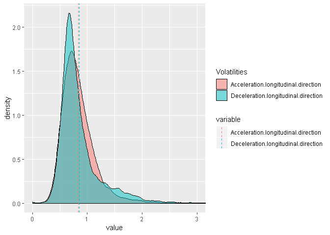

## Data

This exercise makes use of naturalistic driving data from the SHRP-2 study (http://www.trb.org/StrategicHighwayResearchProgram2SHRP2/Blank2.aspx). The data provided here is the computed coefficeint of variation of acceleration/deceleration and jerk, in both longitudinal and lateral directions.

This data set also includes the binary "eventtype"" variable which inform whether the event resulted in an unsafe outcome (1) or a safe outcome (0).


```r
library(foreign)
```

```
## Warning: package 'foreign' was built under R version 3.4.4
```

```r
nds_volatility_fulldata <- read.csv("nds_volatility_fulldata.csv") #import data
summary(nds_volatility_fulldata)
```

```
##    eventtype      Acceleration.longitudinal.direction
##  Min.   :0.0000   Min.   :0.0000                     
##  1st Qu.:0.0000   1st Qu.:0.6235                     
##  Median :0.0000   Median :0.7735                     
##  Mean   :0.2089   Mean   :0.8268                     
##  3rd Qu.:0.0000   3rd Qu.:0.9657                     
##  Max.   :1.0000   Max.   :5.1655                     
##                   NA's   :236                        
##  Deceleration.longitudinal.direction Acceleration.lateral.direction
##  Min.   :0.0000                      Min.   :0.0000                
##  1st Qu.:0.6202                      1st Qu.:0.7877                
##  Median :0.7361                      Median :0.9822                
##  Mean   :0.8453                      Mean   :1.0357                
##  3rd Qu.:0.9378                      3rd Qu.:1.2090                
##  Max.   :6.0932                      Max.   :5.9199                
##  NA's   :325                         NA's   :253                   
##  Deceleration.lateral.direction Postive.jerk.longitudinal.direction
##  Min.   :0.0000                 Min.   :0.2828                     
##  1st Qu.:0.6077                 1st Qu.:0.8900                     
##  Median :0.7128                 Median :0.9967                     
##  Mean   :0.7747                 Mean   :1.1892                     
##  3rd Qu.:0.8697                 3rd Qu.:1.1977                     
##  Max.   :4.2683                 Max.   :9.1257                     
##  NA's   :216                    NA's   :106                        
##  Negative.jerk..longitudinal.direction Postive.jerk.lateral.direction
##  Min.   :0.0000                        Min.   :0.4714                
##  1st Qu.:0.7366                        1st Qu.:0.8820                
##  Median :0.8287                        Median :0.9667                
##  Mean   :0.9917                        Mean   :1.1036                
##  3rd Qu.:1.0092                        3rd Qu.:1.1211                
##  Max.   :6.5926                        Max.   :7.4295                
##  NA's   :109                           NA's   :107                   
##  Negative.jerk..lateral.direction
##  Min.   :0.4330                  
##  1st Qu.:0.7390                  
##  Median :0.8270                  
##  Mean   :0.9393                  
##  3rd Qu.:0.9842                  
##  Max.   :5.8965                  
##  NA's   :109
```

```r
library(DMwR)
```

```
## Warning: package 'DMwR' was built under R version 3.4.4
```

```
## Loading required package: lattice
```

```
## Loading required package: grid
```

```r
manyNAs(nds_volatility_fulldata,0.5) # returns a vector of IDs of the rows with too many NA values (>0.25)
```

```
##   [1]    2   16   36   68  157  159  247  260  287  358  640 1123 1453 1454
##  [15] 1477 2144 2145 2150 2158 2162 2165 2344 2401 2857 3100 3212 3304 3344
##  [29] 3345 3633 4181 4202 4242 4243 4244 4246 4794 4811 4826 5839 5889 6229
##  [43] 6246 6258 6267 6362 7120 7319 7322 7729 7771 7798 7802 8021 8083 8142
##  [57] 8160 8170 8187 8192 8196 8197 8201 8209 8211 8216 8629 8647 8652 8666
##  [71] 8667 8680 8684 8687 8703 8704 8705 8713 8726 8729 8734 8740 8746 8750
##  [85] 8761 8764 8768 8771 8774 8779 8790 8917 8923 8937 8939 8943 8955 8957
##  [99] 8965 9002 9011 9018 9220
```

```r
test <- nds_volatility_fulldata[-manyNAs(nds_volatility_fulldata,0.5),] # with default ratio of 0.5
test2 <- na.omit(nds_volatility_fulldata) #remove all missing values
```
The summary of the data shows a number of missing values in most of the variables.
There are a few ways to address this issue.

The first is to remove all the datapoints with missing values. In this dataset, removing missing values reduces the dataset from 9593 to 8872, which is a deletion of about 7.5% of the data.

Since 7.5% is a minimal value, we can apply this method.

Another method is to impute the values by inserting the mean values of the variables where there is missing data.

We will continue with the cleaned data of 8872 events.


```r
library(reshape2)
```

```
## Warning: package 'reshape2' was built under R version 3.4.4
```

```r
test2 <- as.data.frame(test2)

test3 <- melt(data = test2, id.vars = "eventtype", measure.vars = c("Acceleration.longitudinal.direction", "Deceleration.longitudinal.direction"))
test4 <- melt(data = test2, id.vars = "eventtype", measure.vars = c("Postive.jerk.longitudinal.direction", "Negative.jerk..longitudinal.direction"))
test5 <- melt(data = test2, id.vars = "eventtype", measure.vars = c("Acceleration.lateral.direction", "Deceleration.lateral.direction"))
test6 <- melt(data = test2, id.vars = "eventtype", measure.vars = c("Postive.jerk.lateral.direction", "Negative.jerk..lateral.direction"))

test7 <- melt(data = test2, id.vars = "eventtype", measure.vars = c("Acceleration.longitudinal.direction", "Deceleration.longitudinal.direction","Acceleration.lateral.direction", "Deceleration.lateral.direction"))

test8 <- melt(data = test2, id.vars = "eventtype", measure.vars = c("Postive.jerk.longitudinal.direction", "Negative.jerk..longitudinal.direction","Postive.jerk.lateral.direction", "Negative.jerk..lateral.direction"))
```

The melt function allows us to stack the data.
Here we recreate 4 datasets of postive and negative directions of each metric.
We also create 2 dataset of all the variables separated by the type of metric for further analysis.


## Data Visualisation

Visualizing distributions of data helps us draw inferences about certain statistical metrics such as the difference in means, the range of the data, and the deviations of the distributions of the data.
Data distributions also allow us to choose the appropriate statistical methodology for analysis.


```r
library(ggplot2)
```

```
## Warning: package 'ggplot2' was built under R version 3.4.4
```

```r
# Basic density
p <- ggplot(test4, aes(x=value, fill = variable)) + 
  geom_density(alpha = 0.5)+ coord_cartesian(xlim = c(0, 3)) + scale_fill_discrete (name="Volatilities")
# Add mean line
library(plyr)
```

```
## Warning: package 'plyr' was built under R version 3.4.4
```

```
## 
## Attaching package: 'plyr'
```

```
## The following object is masked from 'package:DMwR':
## 
##     join
```

```r
mu <- ddply(test4, "variable", summarise, grp.mean=mean(value))
p+ geom_vline(data=mu, aes(xintercept=grp.mean, color=variable),
             linetype="dashed")
```

<!-- -->
We observe very similar distributions for the positive and negative metric of longitudinal jerk based volatility. yet we also observe different ranges of the data and a difference in means.


```r
# Basic density
q <- ggplot(test3, aes(x=value, fill = variable)) + 
  geom_density(alpha = 0.5)+ scale_fill_discrete (name="Volatilities") + coord_cartesian(xlim = c(0, 3)) 
# Add mean line
library(plyr)
mu2 <- ddply(test3, "variable", summarise, grp.mean=mean(value))
q+ geom_vline(data=mu2, aes(xintercept=grp.mean, color=variable),
             linetype="dashed")
```

<!-- -->
Acceleration/Deceleration longitudinal volatility has a more normal distribution and similar means.


```r
# Basic density
r <- ggplot(test5, aes(x=value, fill = variable)) + 
  geom_density(alpha = 0.5)+ coord_cartesian(xlim = c(0, 3)) + scale_fill_discrete (name="Volatilities")
# Add mean line
library(plyr)
mu3 <- ddply(test5, "variable", summarise, grp.mean=mean(value))
r+ geom_vline(data=mu3, aes(xintercept=grp.mean, color=variable),
             linetype="dashed")
```

<!-- -->
Acceleration/Deceleration lateral volatility are normally distributed with disimilar means.


```r
# Basic density
s <- ggplot(test6, aes(x=value, fill = variable)) + 
  geom_density(alpha = 0.5)+ scale_fill_discrete (name="Volatilities") + coord_cartesian(xlim = c(0, 3)) # Add mean line
library(plyr)
mu4 <- ddply(test6, "variable", summarise, grp.mean=mean(value))
s+ geom_vline(data=mu4, aes(xintercept=grp.mean, color=variable),
             linetype="dashed")
```

<!-- -->
Positive and negative metric of lateral jerk based volatility show similar relationship to each other as their longitudinal counterparts.

## Statistical modelling

Now that we have observed the distributions and explored their characteristics, we can use a binomial logit model to predict the probabilities of their outcomes based on their volatility measures.


```r
mylogit.1 <- glm(eventtype ~ Postive.jerk.longitudinal.direction + Negative.jerk..longitudinal.direction + Postive.jerk.lateral.direction + Negative.jerk..lateral.direction, data =  test2, family = "binomial")
```

```
## Warning: glm.fit: fitted probabilities numerically 0 or 1 occurred
```

```r
summary(mylogit.1)
```

```
## 
## Call:
## glm(formula = eventtype ~ Postive.jerk.longitudinal.direction + 
##     Negative.jerk..longitudinal.direction + Postive.jerk.lateral.direction + 
##     Negative.jerk..lateral.direction, family = "binomial", data = test2)
## 
## Deviance Residuals: 
##     Min       1Q   Median       3Q      Max  
## -3.8467  -0.2767  -0.1685  -0.1042   3.2651  
## 
## Coefficients:
##                                       Estimate Std. Error z value Pr(>|z|)
## (Intercept)                           -13.2189     0.3118 -42.391   <2e-16
## Postive.jerk.longitudinal.direction     2.0122     0.2027   9.925   <2e-16
## Negative.jerk..longitudinal.direction   6.0491     0.2558  23.650   <2e-16
## Postive.jerk.lateral.direction          2.5758     0.2918   8.828   <2e-16
## Negative.jerk..lateral.direction        0.1982     0.2882   0.688    0.492
##                                          
## (Intercept)                           ***
## Postive.jerk.longitudinal.direction   ***
## Negative.jerk..longitudinal.direction ***
## Postive.jerk.lateral.direction        ***
## Negative.jerk..lateral.direction         
## ---
## Signif. codes:  0 '***' 0.001 '**' 0.01 '*' 0.05 '.' 0.1 ' ' 1
## 
## (Dispersion parameter for binomial family taken to be 1)
## 
##     Null deviance: 9200.8  on 8871  degrees of freedom
## Residual deviance: 3155.2  on 8867  degrees of freedom
## AIC: 3165.2
## 
## Number of Fisher Scoring iterations: 7
```

As we observe from the statistical output of the model that most of the metrics are significant in predicting the event outcome. the AIC value of this model is 3165.2


```r
mylogit.2 <- glm(eventtype ~ Acceleration.longitudinal.direction + Deceleration.longitudinal.direction + Acceleration.lateral.direction + Deceleration.lateral.direction, data =  test2, family = "binomial")
```

```
## Warning: glm.fit: fitted probabilities numerically 0 or 1 occurred
```

```r
summary(mylogit.2)
```

```
## 
## Call:
## glm(formula = eventtype ~ Acceleration.longitudinal.direction + 
##     Deceleration.longitudinal.direction + Acceleration.lateral.direction + 
##     Deceleration.lateral.direction, family = "binomial", data = test2)
## 
## Deviance Residuals: 
##     Min       1Q   Median       3Q      Max  
## -3.2998  -0.3428  -0.1978  -0.0854   3.7913  
## 
## Coefficients:
##                                     Estimate Std. Error z value Pr(>|z|)
## (Intercept)                         -12.4230     0.3031 -40.991  < 2e-16
## Acceleration.longitudinal.direction   0.4263     0.1363   3.129  0.00175
## Deceleration.longitudinal.direction   6.9029     0.1787  38.634  < 2e-16
## Acceleration.lateral.direction        1.0951     0.1198   9.138  < 2e-16
## Deceleration.lateral.direction        3.7466     0.1674  22.380  < 2e-16
##                                        
## (Intercept)                         ***
## Acceleration.longitudinal.direction ** 
## Deceleration.longitudinal.direction ***
## Acceleration.lateral.direction      ***
## Deceleration.lateral.direction      ***
## ---
## Signif. codes:  0 '***' 0.001 '**' 0.01 '*' 0.05 '.' 0.1 ' ' 1
## 
## (Dispersion parameter for binomial family taken to be 1)
## 
##     Null deviance: 9200.8  on 8871  degrees of freedom
## Residual deviance: 3897.6  on 8867  degrees of freedom
## AIC: 3907.6
## 
## Number of Fisher Scoring iterations: 6
```

As we observe from the statistical output of the model that the metrics are very significant in predicting the event outcome. The AIC of this model is 3907.6 which is larger than 3165.2 and thus shows that the previous model and the metrics used are a btter fitting model than this model with the selected metrics.


```r
covariates <- c("Acceleration.longitudinal.direction", "Deceleration.longitudinal.direction","Acceleration.lateral.direction", "Deceleration.lateral.direction")
univ_formulas <- sapply(covariates,
                        function(x) as.formula(paste('eventtype ~', x)))

univ_models <- lapply(univ_formulas, function(x){glm(x, data = test2, family = "binomial")})
```

```
## Warning: glm.fit: fitted probabilities numerically 0 or 1 occurred
```

```r
univ_models
```

```
## $Acceleration.longitudinal.direction
## 
## Call:  glm(formula = x, family = "binomial", data = test2)
## 
## Coefficients:
##                         (Intercept)  Acceleration.longitudinal.direction  
##                              -2.179                                1.015  
## 
## Degrees of Freedom: 8871 Total (i.e. Null);  8870 Residual
## Null Deviance:	    9201 
## Residual Deviance: 9026 	AIC: 9030
## 
## $Deceleration.longitudinal.direction
## 
## Call:  glm(formula = x, family = "binomial", data = test2)
## 
## Coefficients:
##                         (Intercept)  Deceleration.longitudinal.direction  
##                              -7.721                                6.895  
## 
## Degrees of Freedom: 8871 Total (i.e. Null);  8870 Residual
## Null Deviance:	    9201 
## Residual Deviance: 4803 	AIC: 4807
## 
## $Acceleration.lateral.direction
## 
## Call:  glm(formula = x, family = "binomial", data = test2)
## 
## Coefficients:
##                    (Intercept)  Acceleration.lateral.direction  
##                         -2.845                           1.409  
## 
## Degrees of Freedom: 8871 Total (i.e. Null);  8870 Residual
## Null Deviance:	    9201 
## Residual Deviance: 8736 	AIC: 8740
## 
## $Deceleration.lateral.direction
## 
## Call:  glm(formula = x, family = "binomial", data = test2)
## 
## Coefficients:
##                    (Intercept)  Deceleration.lateral.direction  
##                         -4.363                           3.680  
## 
## Degrees of Freedom: 8871 Total (i.e. Null);  8870 Residual
## Null Deviance:	    9201 
## Residual Deviance: 7752 	AIC: 7756
```

```r
covariates.1 <- c("Postive.jerk.longitudinal.direction", "Negative.jerk..longitudinal.direction","Postive.jerk.lateral.direction", "Negative.jerk..lateral.direction")
univ_formulas.1 <- sapply(covariates.1,
                        function(x) as.formula(paste('eventtype ~', x)))

univ_models.1 <- lapply(univ_formulas.1, function(x){glm(x, data = test2, family = "binomial")})
```

```
## Warning: glm.fit: fitted probabilities numerically 0 or 1 occurred

## Warning: glm.fit: fitted probabilities numerically 0 or 1 occurred

## Warning: glm.fit: fitted probabilities numerically 0 or 1 occurred
```

```r
univ_models.1
```

```
## $Postive.jerk.longitudinal.direction
## 
## Call:  glm(formula = x, family = "binomial", data = test2)
## 
## Coefficients:
##                         (Intercept)  Postive.jerk.longitudinal.direction  
##                              -9.475                                6.700  
## 
## Degrees of Freedom: 8871 Total (i.e. Null);  8870 Residual
## Null Deviance:	    9201 
## Residual Deviance: 4372 	AIC: 4376
## 
## $Negative.jerk..longitudinal.direction
## 
## Call:  glm(formula = x, family = "binomial", data = test2)
## 
## Coefficients:
##                           (Intercept)  
##                               -10.365  
## Negative.jerk..longitudinal.direction  
##                                 8.694  
## 
## Degrees of Freedom: 8871 Total (i.e. Null);  8870 Residual
## Null Deviance:	    9201 
## Residual Deviance: 3664 	AIC: 3668
## 
## $Postive.jerk.lateral.direction
## 
## Call:  glm(formula = x, family = "binomial", data = test2)
## 
## Coefficients:
##                    (Intercept)  Postive.jerk.lateral.direction  
##                         -7.168                           5.188  
## 
## Degrees of Freedom: 8871 Total (i.e. Null);  8870 Residual
## Null Deviance:	    9201 
## Residual Deviance: 6183 	AIC: 6187
## 
## $Negative.jerk..lateral.direction
## 
## Call:  glm(formula = x, family = "binomial", data = test2)
## 
## Coefficients:
##                      (Intercept)  Negative.jerk..lateral.direction  
##                           -5.790                             4.553  
## 
## Degrees of Freedom: 8871 Total (i.e. Null);  8870 Residual
## Null Deviance:	    9201 
## Residual Deviance: 6770 	AIC: 6774
```

Fitting Univariate models of the variables allows us to predict the individual probabilities of each event with regard to each selected covariate.

After we have predidcted the proabilities of each individual event as per the selected variable, we plot the probability curves of the events and compare the curves of each variable.


```r
newdata <- test2[c(2)]
newdata$probabilities <- univ_models$Acceleration.longitudinal.direction$fitted.values
newdata <- melt(data = newdata, id.vars = "probabilities", measure.vars = c("Acceleration.longitudinal.direction"))

newdata.2 <- test2[c(3)]
newdata.2$probabilities <- univ_models$Deceleration.longitudinal.direction$fitted.values
newdata.2 <- melt(data = newdata.2, id.vars = "probabilities", measure.vars = c("Deceleration.longitudinal.direction"))

newdata.3 <- test2[c(4)]
newdata.3$probabilities <- univ_models$Acceleration.lateral.direction$fitted.values
newdata.3 <- melt(data = newdata.3, id.vars = "probabilities", measure.vars = c("Acceleration.lateral.direction"))

newdata.4 <- test2[c(5)]
newdata.4$probabilities <- univ_models$Deceleration.lateral.direction$fitted.values
newdata.4 <- melt(data = newdata.4, id.vars = "probabilities", measure.vars = c("Deceleration.lateral.direction"))

newdata.5 <- test2[c(6)]
newdata.5$probabilities <- univ_models.1$Postive.jerk.longitudinal.direction$fitted.values
newdata.5 <- melt(data = newdata.5, id.vars = "probabilities", measure.vars = c("Postive.jerk.longitudinal.direction"))

newdata.7 <- test2[c(8)]
newdata.7$probabilities <- univ_models.1$Postive.jerk.lateral.direction$fitted.values
newdata.7 <- melt(data = newdata.7, id.vars = "probabilities", measure.vars = c("Postive.jerk.lateral.direction"))

newdata.6 <- test2[c(7)]
newdata.6$probabilities <- univ_models.1$Negative.jerk..longitudinal.direction$fitted.values
newdata.6 <- melt(data = newdata.6, id.vars = "probabilities", measure.vars = c("Negative.jerk..longitudinal.direction"))

newdata.8 <- test2[c(9)]
newdata.8$probabilities <- univ_models.1$Negative.jerk..lateral.direction$fitted.values
newdata.8 <- melt(data = newdata.8, id.vars = "probabilities", measure.vars = c("Negative.jerk..lateral.direction"))

covacc.n <- rbind(newdata, newdata.2, newdata.3, newdata.4)
covjerk.n <- rbind(newdata.5, newdata.6, newdata.7, newdata.8)
```
We create two datasets of the probabilities of the events for plotting.


```r
library(readr)
```

```
## Warning: package 'readr' was built under R version 3.4.4
```

```r
covjerk <- read_csv("covjerk.csv") #cleaned the dataset labeling
```

```
## Parsed with column specification:
## cols(
##   probability = col_double(),
##   volatility = col_double(),
##   vol. = col_character()
## )
```

```r
covacc <- read_csv("covacc.csv")
```

```
## Parsed with column specification:
## cols(
##   probability = col_double(),
##   volatility = col_double(),
##   vol. = col_character()
## )
```


```r
library(ggplot2)
# Basic scatter plot
ggplot(covacc, aes(y=probability, x=volatility, colour=vol.))+geom_line(size=1)+ theme(legend.position = c(.77, .2))
```

<!-- -->

```r
ggplot(covjerk,aes(y=probability, x=volatility, colour=vol.))+geom_line(size=1)+ coord_cartesian(xlim = c(0,6))+ theme(legend.position = c(.72, .2))
```

<!-- -->

We observe that jerk based volatilities are more sensitive to the outcome of the event than acceleration/deceleration volatilities.


